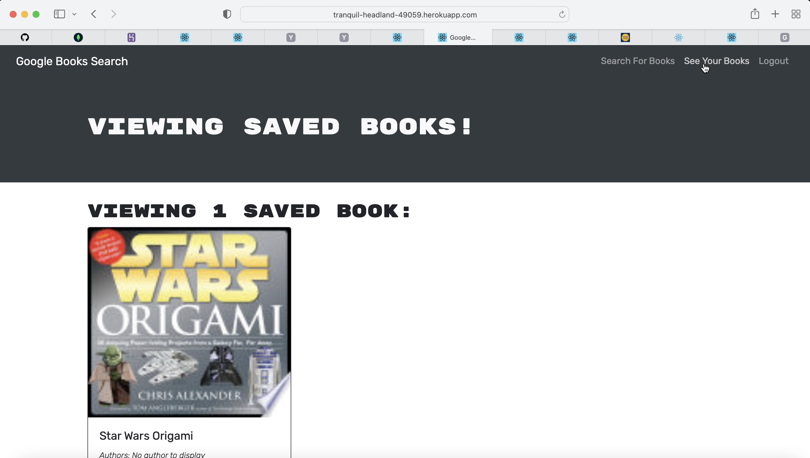

# Book-Search-Engine-MERN

## User Story

```md
AS AN avid reader
I WANT to search for new books to read
SO THAT I can keep a list of books to purchase
```

## Description
This assignment showcases a fully functioning Google Books API search engine with a GraphQL API built with Apollo Server. The app was built using the MERN stack with a React front end, MongoDB database, and Node.js/Express.js server and API.

It sets up an Apollo Server to use GraphQL queries and mutations to fetch and modify data. I have defined the authentication middleware so that it works in the context of a GraphQL API. Also, I have created an Apollo Provider so that requests can communicate with an Apollo Server.

Finally, I have deployed the application to Heroku with a MongoDB database using MongoDB Atlas.

The app does the following:

- Given a book search engine, when I load the search engine then I am presented with a menu with the options Search for Books and Login/Signup and an input field to search for books and a submit button.

- When I click on the Search for Books menu option, then I am presented with an input field to search for books and a submit button.

-When I am not logged in and enter a search term in the input field and click the submit button, then I am presented with several search results, each featuring a book’s title, author, description, image, and a link to that book on the Google Books site.

-When I click on the Login/Signup menu option, then a modal appears on the screen with a toggle between the option to log in or sign up.

-When the toggle is set to Signup, then I am presented with three inputs for a username, an email address, and a password, and a signup button.

- When the toggle is set to Login, then I am presented with two inputs for an email address and a password and login button.

- When I enter a valid email address and create a password and click on the signup button, then my user account is created and I am logged in to the site.

-When I enter my account’s email address and password and click on the login button, then I the modal closes and I am logged in to the site.

-When I am logged in to the site, then the menu options change to Search for Books, an option to see my saved books, and Logout.

-When I am logged in and enter a search term in the input field and click the submit button, then I am presented with several search results, each featuring a book’s title, author, description, image, and a link to that book on the Google Books site and a button to save a book to my account.

-When I click on the Save button on a book, then that book’s information is saved to my account.

-When I click on the option to see my saved books, then I am presented with all of the books I have saved to my account, each featuring the book’s title, author, description, image, and a link to that book on the Google Books site and a button to remove a book from my account.

- When I click on the Remove button on a book, then that book is deleted from my saved books list.

-When I click on the Logout button, then I am logged out of the site and presented with a menu with the options Search for Books and Login/Signup and an input field to search for books and a submit button.

## Installation Instructions

In order to run the app, we need to run the following commands:

- npx create-react-app : This will create the public folder with all the necessary files.
- npm i - This will install the node modules.
- npm i bootstrap : This will help retrieve the bootstrap library.
- npm install react-router-dom
- npm install @apollo/client graphql
- npm install jwt-decode
- npm install @apollo/react-hooks

## Screenshots




